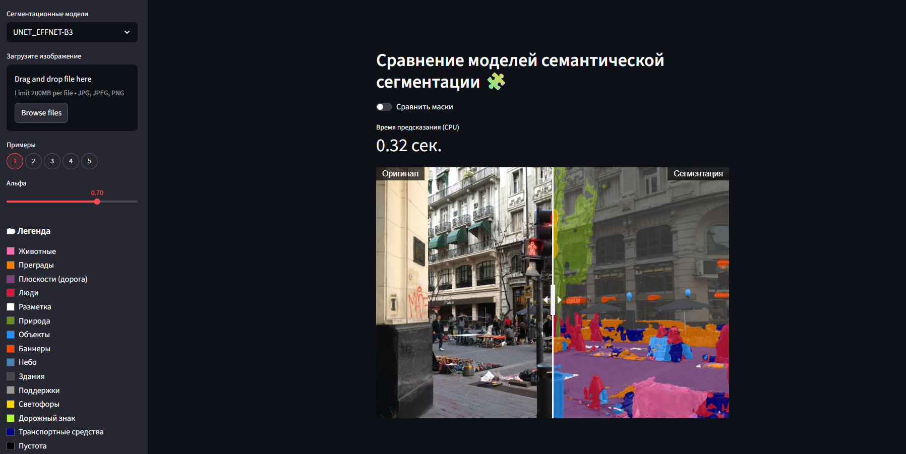
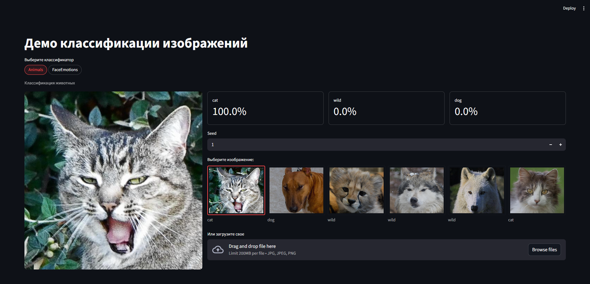

# ML Portfolio

Портфолио по машинному обучению и computer vision.  
В репозитории собраны проекты с фокусом на **semantic segmentation**, **image classification**, **face expression recognition**, **text classification**, а также на **инференс**, **сравнение моделей** и **demo-приложения**.

---

## О репозитории

Этот репозиторий — моя подборка практических ML/CV-проектов, где важны не только эксперименты с моделями, но и инженерная упаковка решения:

- подготовка и загрузка данных;
- кастомные датасеты и аугментации;
- обучение и сравнение нескольких архитектур;
- работа с дисбалансом классов;
- оценка качества моделей;
- demo-приложения для инференса и визуальной проверки результата.

Основной стек: **Python, PyTorch, PyTorch Lightning, Streamlit, scikit-learn, transformers**.

---

## Проекты

### 1. Semantic Segmentation of Urban Scenes (Mapillary Vistas)

Проект по семантической сегментации городских сцен на датасете **Mapillary Vistas**.



Что сделано:
- реализован кастомный `dataset` для polygon-разметки из JSON;
- собран пайплайн генерации `segmentation masks`;
- добавлены синхронные transforms для `image/mask`;
- проведены эксперименты с редкими классами и дисбалансом;
- обучены и сравнены несколько архитектур:
  - U-Net
  - Custom U-Net
  - DeepLabV3+
  - SegFormer
- сделано **Streamlit demo** для сравнения моделей по:
  - overlay-маскам,
  - `mIoU`,
  - `IoU` по целевому классу,
  - времени инференса на CPU.

Папка проекта:  
`segmentation/mapillary-vistas-segmentation/`

---

### 2. Image Classification / Face Expression Recognition

Проекты по классификации изображений и распознаванию эмоций по лицу.



Что сделано:
- обучение моделей для задачи **Animals**;
- обучение модели для **Face Expression Recognition**;
- demo-приложение на **Streamlit**;
- эксперименты с:
  - distillation,
  - quantization,
  - ONNX export.

Использованные модели:
- **ConvNeXtV2 Base** — для классификации изображений животных;
- **ConvNeXtV2 Tiny** — для распознавания эмоций по лицу.

Папка проекта:  
`classification/`

---

### 3. Twitter Sentiment Analysis

Проект по классификации тональности твитов.

Что сделано:
- сравнение классических и нейросетевых подходов;
- baseline на **TF-IDF + Multinomial Naive Bayes**;
- эксперименты с **SMOTE / ADASYN**;
- работа с дисбалансом классов через **WeightedRandomSampler** и **Focal Loss**;
- использование **transformers** для эмбеддингов и нейросетевой модели.

Папка проекта:  
`classification/TwitterSentimentAnalysis/`

---

## Быстрый старт

### 1. Клонирование репозитория

```bash
git clone https://github.com/Slipernik/ml-portfolio.git
cd ml-portfolio
```

### 2. Установка зависимостей

```bash
pip install -r requirements.txt
```

### 3. Скачивание весов моделей и масок изображений

Перед запуском demo необходимо скачать `.pt` и `.ckpt` файлы.  
Для этого используется `loader.py`.

```bash
python loader.py
```

Скрипт загружает необходимые веса моделей и вспомогательные файлы для demo.

### 4. Запуск demo

#### Segmentation demo

```bash
cd segmentation/mapillary-vistas-segmentation/demo
streamlit run app.py
```

#### Classification demo

```bash
cd classification/demo
streamlit run app.py
```

---

## Что показывает этот репозиторий

Мне интересны прикладные задачи ML/CV, где важно:

- не только обучить модель;
- но и подготовить данные;
- аккуратно организовать эксперимент;
- сравнить несколько подходов;
- оценить результат;
- и довести решение до удобного demo или inference-сценария.

---

## Контакты

- **Email:** slipernik@me.com
- **GitHub:** https://github.com/Slipernik/ml-portfolio
- **Telegram:** @LeshkaGarmoshka

Если вам интересен мой профиль для роли **Junior ML Engineer / Computer Vision Engineer**, буду рад контакту.